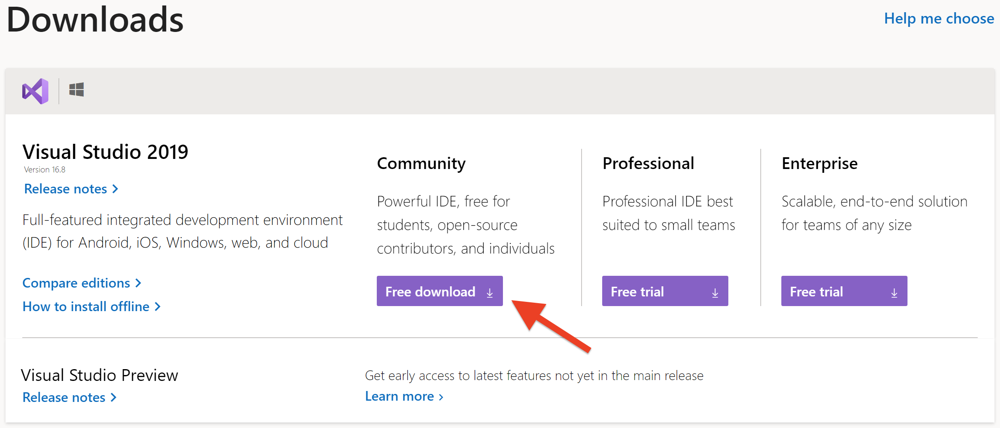
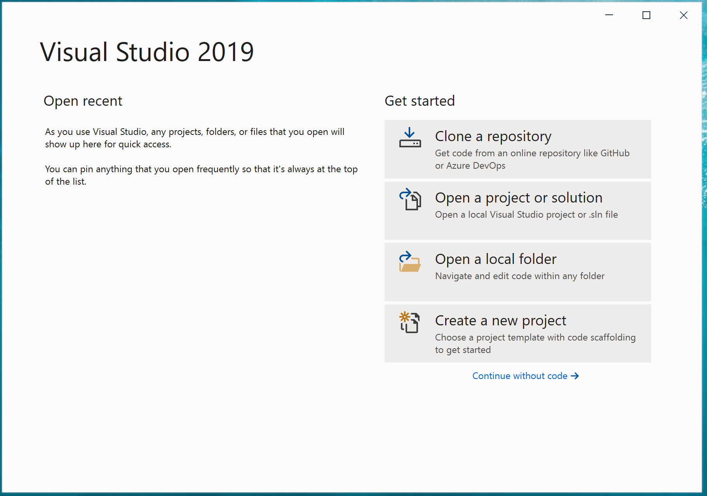
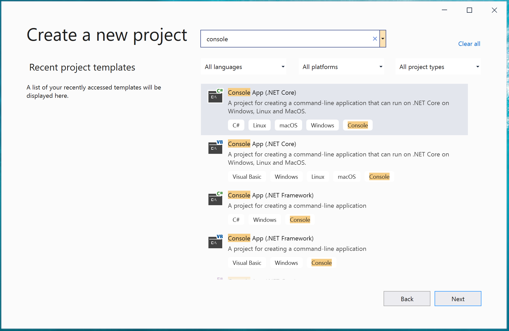
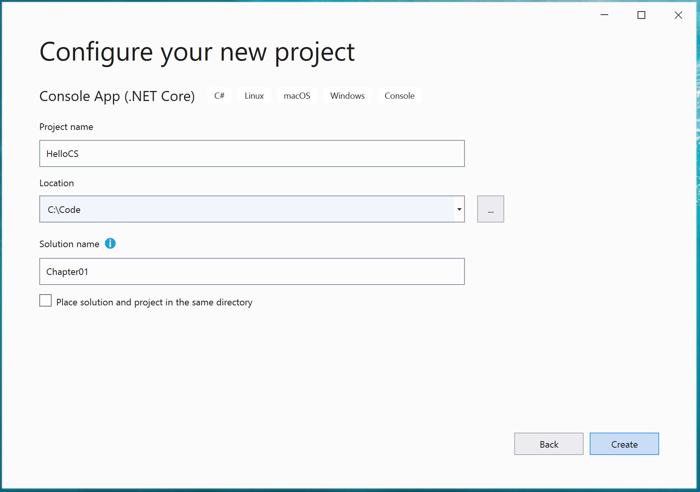
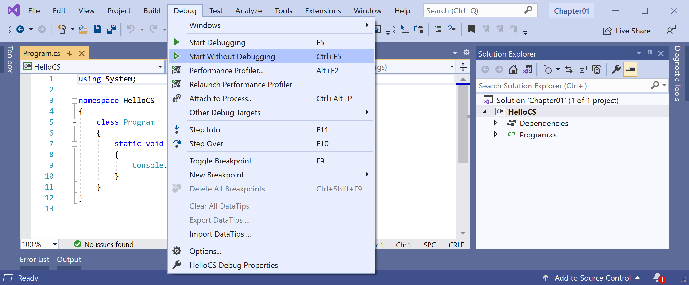
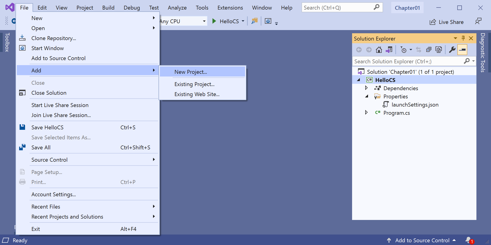
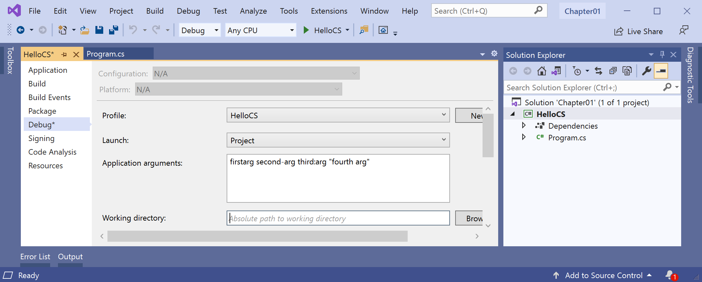

# Using Microsoft Visual Studio 2019 on Windows

If you are reluctant to use Visual Studio Code then this article will show you how to complete the coding tasks in my book using Microsoft Visual Studio 2019 on Windows.

Remember: only the user interface of your tool is different. The code you write is identical.

## Installing Microsoft Visual Studio 2019 for Windows

I recommend the latest version of Windows 10 although Microsoft Visual Studio 2019 supports Windows 7 SP1, Windows 8.1, or Windows 10 version 1703 or higher.

1. Make sure that you have the latest Windows 10 patches installed by running Windows Update.
2. Start your favorite browser and navigate to https://visualstudio.microsoft.com/downloads/
3. If you want the free edition, then in the Community box, click **Free download**, as shown in the following screenshot:



4. In the **Visual Studio Installer**, select the **Workloads** tab, and then (at a minimum) select the following workloads: ASP.NET and web development, .NET desktop development, Universal Windows Platform development, and .NET Core cross-platform development.

## Creating Console Apps using Visual Studio 2019

My book gives step-by-step instructions using Visual Studio Code. Although the code you type will be identical, the user interface for the tool is different.

Follow these steps to create a Console App using Visual Studio 2019.

1. Start Visual Studio 2019.
2. Click **Create a new project**, as shown in the following screenshot:



3. In the **Create a new project** dialog box, in the **Search for templates** box, enter `console`, as shown in the following screenshot:



4. Select the **C#** language **Console App (.NET Core)** and then click **Next**.
5. Select `C:\Code` as the location, enter a project name and solution name, and then click **Create**, as shown in the following screenshot:



6. In **Solution Explorer**, open the project file, for example, `HelloCS.csproj`.
7. Visual Studio 2019 version 16.8 Console App template sets the project target framework to .NET Core 3.1, as shown in the following markup:
```
<Project Sdk="Microsoft.NET.Sdk">

  <PropertyGroup>
    <OutputType>Exe</OutputType>
    <TargetFramework>netcoreapp3.1</TargetFramework>
  </PropertyGroup>

</Project>
```
8. Modify the target framework to use .NET 5.0, as shown in the following markup:
```
<Project Sdk="Microsoft.NET.Sdk">

  <PropertyGroup>
    <OutputType>Exe</OutputType>
    <TargetFramework>net5.0</TargetFramework>
  </PropertyGroup>

</Project>
```

Note: Microsoft says that Visual Studio 2019 version 16.9 will target .NET 5.0 by default so you will not have to do this manually.

7. Save changes and close the project file.
8. To run a Console App project, navigate to **Debug** | **Start Without Debugging**, as shown in the following screenshot:



## Adding projects to a solution

Visual Studio Code uses workspaces to work on multiple projects at the same time. (It can also use solution files but these are Microsoft-specific. Workspaces are more general so work with non-Microsoft technologies.)

Visual Studio 2019 uses solution files to work on multiple projects at the same time. One is created when you create a new project. 

Instead of creating a new solution with each new project, you can add more projects to the existing solution by navigating to **File** | **Add** | **New Project...** or **Existing Project...**, as shown in the following screenshot:



## Passing arguments to a console app using Visual Studio 2019

In **Chapter 2**, in the **Getting arguments** topic starting on page 67, I show how to pass arguments in Terminal, as shown in the following command:
```
dotnet run firstarg second-arg third:arg "fourth arg"
```
To pass arguments using Visual Studio 2019:

1. In **Solution Explorer**, right-click the **Arguments** project and choose **Properties**, or navigate to **Project** | **Arguments Properties**.
2. On the **Debug** tab, in the **Arguments** box, enter `firstarg second-arg third:arg "fourth arg"`, as shown in the following screenshot:



## Debugging using Visual Studio 2019

Coming soon.

## Storing the Northwind database in Microsoft SQL Server instead of SQLite on Windows

I have written a separate [article](../sqlserver/README.md) about using Microsoft SQL Server instead of SQLite to store the Northwind database that is used in many coding tasks from Chapter 14 onwards.